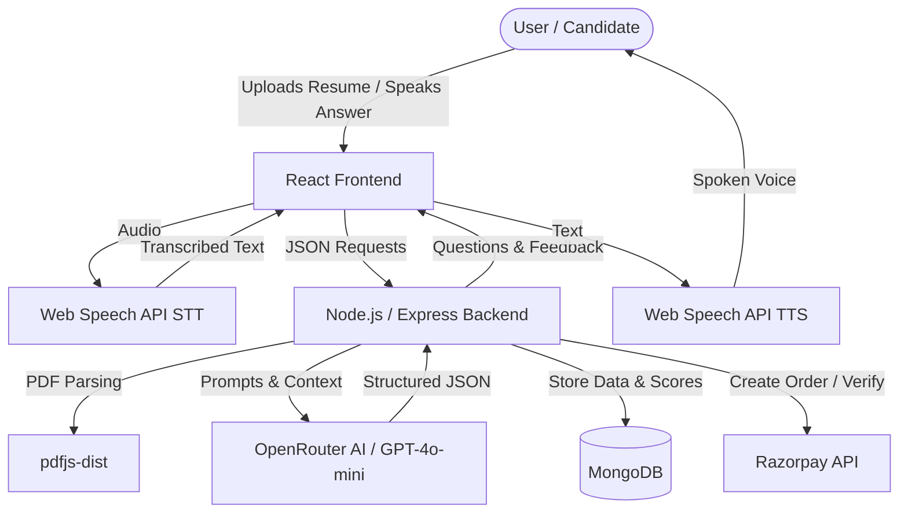

<div align="center">
  <h1>🚀 InterviewIQ</h1>
  <p>An AI-powered mock interview platform featuring real-time voice interaction, resume parsing, and instant performance analytics.</p>

  <p>
    
    
    
    
  </p>
</div>

## 📑 Quick Navigation

- [Project Overview](#-project-overview)
- [Key Features](#-key-features)
- [Tech Stack](#-tech-stack)
- [Architecture](#-architecture)
- [How It Works](#-how-it-works)
- [Technical Implementation](#-technical-implementation)
- [Project Structure](#-project-structure)
- [Installation & Setup](#-installation--setup)
- [Environment Variables](#-environment-variables)
- [API Reference](#-api-reference)
- [Database Schema](#-database-schema)
- [Security](#-security)
- [Future Improvements](#-future-improvements)

## 📖 Project Overview

InterviewIQ is a full-stack mock interview application designed to help job seekers, students, and professionals practice their interview skills in a realistic, low-pressure environment. 

Instead of relying on a human interviewer, InterviewIQ leverages LLMs and native browser speech APIs to dynamically parse a candidate's resume, generate role-specific questions, and conduct a voice-based interview. It provides real-time scoring across multiple metrics to deliver actionable feedback instantly.

## ✨ Key Features

- **📄 Intelligent Resume Parsing:** Extracts skills, roles, and experience from uploaded PDFs to tailor interview context.
- **🗣️ Voice-Interactive AI Avatar:** Uses browser-native Speech-to-Text and Text-to-Speech for a realistic, hands-free conversational experience.
- **🧠 Dynamic Question Generation:** Generates exactly 5 progressive questions (Easy to Hard) based on the candidate's parsed resume and selected interview mode (HR or Technical).
- **📊 Real-Time AI Evaluation:** Scores candidate answers out of 10 based on Confidence, Communication, and Correctness, generating instant human-like feedback.
- **💳 Credit-Based System:** Seamless Razorpay payment gateway integration for purchasing interview credits.
- **📈 Interactive Analytics:** Visualizes historical interview performance and metric trends using Recharts.

## 🛠 Tech Stack

| Category | Technologies |
|---|---|
| **Frontend** | React 19, Vite, Tailwind CSS v4, Redux Toolkit, Framer Motion, Recharts |
| **Backend** | Node.js, Express.js, Multer, `pdfjs-dist` |
| **Database** | MongoDB, Mongoose |
| **AI / NLP** | OpenRouter API (GPT-4o-mini model) |
| **Authentication** | JWT (HTTP-Only Cookies), Firebase Auth (Google) |
| **Payments** | Razorpay |
| **Browser APIs** | Web Speech API (`webkitSpeechRecognition`, `SpeechSynthesis`) |

## 🏗 Architecture



## ⚙️ How It Works

1. **Resume Processing:** The user uploads their resume (PDF). The backend extracts the raw text using `pdfjs-dist` and sends it to the AI to extract structured entities (Skills, Projects, Experience).
2. **Setup:** The user selects the role, experience level, and interview mode (HR/Technical).
3. **Question Generation:** The AI generates exactly 5 questions matching the user's profile, featuring a progressive difficulty curve.
4. **The Interview:** The frontend utilizes `SpeechSynthesis` to speak the questions aloud. The user answers using their microphone, transcribed locally via `webkitSpeechRecognition`.
5. **Evaluation:** The transcribed answer is sent to the backend where the AI evaluates it on three dimensions (Confidence, Communication, Correctness) and returns actionable feedback.
6. **Report:** After 5 questions, the overall score is aggregated and displayed in an interactive dashboard.

## 🔬 Important Technical Implementation

### Audio Cost & Latency Optimization
Instead of relying on expensive cloud APIs for audio transcription (like Whisper), the project implements the browser-native `webkitSpeechRecognition` and `SpeechSynthesis` APIs. Custom adjustments to pitch and pacing are applied to the TTS engine to simulate a natural, human-like interviewer voice, significantly reducing operational costs and latency.

### AI Prompt Engineering & Data Structuring
The backend utilizes strict system prompts to force the LLM (`gpt-4o-mini`) to return perfectly structured JSON objects. This allows the Node.js server to safely `JSON.parse()` the AI's response for both resume extraction and answer evaluation without breaking the application logic.

### Safe File Handling
File uploads are handled asynchronously with `multer`. To prevent server memory bloat on failed parses or unexpected errors, the backend implements automatic file system cleanup (`fs.unlinkSync`) within `try/catch/finally` blocks.

## 📂 Project Structure

```text
project-root/
├── client/                 # React Frontend
│   ├── public/             # Static assets
│   └── src/
│       ├── assets/         # Video and image assets
│       ├── components/     # Reusable UI elements (Timer, Steps, Navbar)
│       ├── pages/          # Full page views (Home, InterviewPage, Pricing)
│       ├── redux/          # Global state management
│       └── utils/          # Helper functions
├── server/                 # Express Backend
│   ├── config/             # DB and Token configs
│   ├── controllers/        # Core business logic (AI pipelines, payments)
│   ├── middlewares/        # Auth & Multer middlewares
│   ├── models/             # Mongoose schemas (User, Interview, Payment)
│   ├── routes/             # API endpoint definitions
│   └── services/           # Third-party integrations (OpenRouter, Razorpay)
└── README.md
```

## 🚀 Installation & Setup

### Prerequisites
- Node.js (v18 or higher)
- MongoDB (Local or Atlas URI)
- OpenRouter API Key
- Razorpay Account (Test Mode Keys)
- Firebase Account (Web setup)

### 1. Clone the repository
```bash
git clone <repository-url>
cd InterviewIQ
```

### 2. Setup Backend
```bash
cd server
npm install
```
Create a `.env` file in the `server` directory (see [Environment Variables](#-environment-variables)).
```bash
npm run dev
```

### 3. Setup Frontend
Open a new terminal.
```bash
cd client
npm install
```
Create a `.env` file in the `client` directory.
```bash
npm run dev
```

## 🔐 Environment Variables

### Server (`server/.env`)
| Variable | Purpose |
|----------|---------|
| `PORT` | The port the backend runs on (e.g., 8000) |
| `MONGODB_URL` | MongoDB connection string |
| `JWT_SECRET` | Secret key for signing JWT cookies |
| `OPENROUTER_API_KEY` | API Key for GPT-4o-mini access |
| `RAZORPAY_KEY_ID` | Razorpay public key |
| `RAZORPAY_KEY_SECRET` | Razorpay private secret |

### Client (`client/.env`)
| Variable | Purpose |
|----------|---------|
| `VITE_FIREBASE_APIKEY` | Firebase API Key for Google Auth |
| `VITE_RAZORPAY_KEY_ID` | Razorpay public key for checkout UI |

> [!IMPORTANT]
> Never commit your actual `.env` files to version control.

## 🔌 API Reference

### Authentication
| Method | Endpoint | Purpose |
|--------|----------|---------|
| `POST` | `/api/auth/googleAuth` | Authenticates/registers a user via Google Auth |
| `POST` | `/api/auth/logout` | Clears the JWT cookie |

### Interviews
| Method | Endpoint | Purpose |
|--------|----------|---------|
| `POST` | `/api/interview/analyze-resume` | Extracts JSON data from a PDF upload |
| `POST` | `/api/interview/generate-question` | Generates 5 interview questions and consumes credits |
| `POST` | `/api/interview/submit-answer` | Evaluates a user's answer and returns scores/feedback |
| `POST` | `/api/interview/finish` | Completes the interview and aggregates final scores |
| `GET`  | `/api/interview/my-interviews` | Retrieves the current user's interview history |
| `GET`  | `/api/interview/report/:id` | Fetches details for a specific interview report |

### Payments
| Method | Endpoint | Purpose |
|--------|----------|---------|
| `POST` | `/api/payment/create-order` | Initializes a Razorpay order |
| `POST` | `/api/payment/verify-payment` | Verifies Razorpay signature and adds credits to user |

## 🗄️ Database Schema

| Model | Purpose | Key Fields |
|-------|---------|------------|
| **User** | Stores user profiles and credits | `name`, `email`, `credits` |
| **Interview** | Stores interview metadata and history | `userId`, `role`, `experience`, `mode`, `questions[]`, `finalScore`, `status` |
| **Payment** | Tracks Razorpay transactions | `userId`, `planId`, `amount`, `credits`, `razorpayOrderId`, `status` |

## 🛡️ Security

- **Authentication:** Sessions are managed using JSON Web Tokens (JWT) stored securely in `HTTP-Only` cookies to mitigate XSS attacks.
- **Payment Verification:** Razorpay webhooks are cryptographically verified using `crypto.createHmac` (SHA-256) to ensure order integrity and prevent spoofing.
- **File Validation:** `multer` ensures only expected multipart form data is processed during resume uploads.

## 📊 Performance & Metrics

- **Question Set:** Exactly 5 progressive difficulty questions per session.
- **Evaluation Dimensions:** 3 specific dimensions scored out of 10 (Confidence, Communication, Correctness).
- **Cost:** 50 credits consumed per generated interview.

## 🗺️ Future Improvements

- Add support for multiple LLM providers (e.g., Anthropic, Groq) to reduce API reliance.
- Implement WebSocket integration for completely real-time conversational interruption capability.
- Support for code-execution environments in Technical Interview mode.

## 👨‍💻 Author

**Pushkar Kumar**
- GitHub: [@Pushkarkumar4527](https://github.com/Pushkarkumar4527)
